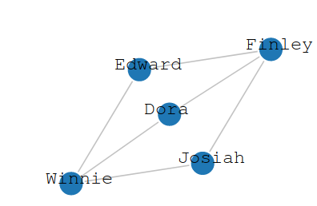

## Criação de Grafos com a bilbioteca GraphX do Spark e GraphFrames

 

Tutorial que utiliza as bibliotecas Spark GraphX (https://spark.apache.org/graphx/
), GraphFrames (https://graphframes.github.io/) e D3 (https://d3js.org/) para criação, análise e visualização de Grafos no Spark.

Ver **tutorial.ipynb**

 

